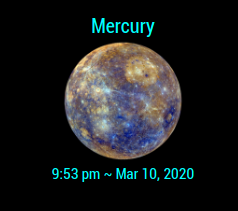
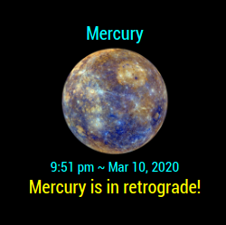

## MMM-MercuryInRetrograde

* Astronomers want to know when the planet Mercury is in retrograde.

* Functions as a simple clock until it notifies you when Mercury is in retrograde.

* Static image or seamless animation of the planet Mercury.

## Examples

 - 

Annotated .css file included for aligning and coloring text.
css file also used to display as little or as much data as you like.

## Installation

* `git clone https://github.com/mykle1/MMM-MercuryInRetrograde` into the `~/MagicMirror/modules` directory.

* No API key needed! No dependencies needed! No kidding!

## Config.js entry and options

```
{
  disabled: false,
  module: 'MMM-MercuryInRetrograde',
  position: 'top center',
  config: {
    image: "static",    // static or gif * Use of gif may not work well on Raspberry Pi
    maxWidth: "250px",
    updateInterval: 1 * 60 * 1000,
  }
},
```
